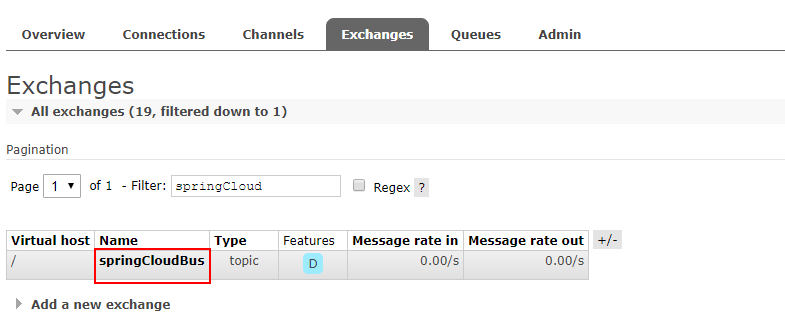

mall项目全套学习教程连载中，[关注公众号](#公众号)第一时间获取。

# Spring Cloud Bus：消息总线

> Spring Cloud Bus 使用轻量级的消息代理来连接微服务架构中的各个服务，可以将其用于广播状态更改（例如配置中心配置更改）或其他管理指令，本文将对其用法进行详细介绍。

## Spring Cloud Bus 简介

我们通常会使用消息代理来构建一个主题，然后把微服务架构中的所有服务都连接到这个主题上去，当我们向该主题发送消息时，所有订阅该主题的服务都会收到消息并进行消费。使用 Spring Cloud Bus 可以方便地构建起这套机制，所以 Spring Cloud Bus 又被称为消息总线。Spring Cloud Bus 配合 Spring Cloud Config 使用可以实现配置的动态刷新。目前  Spring Cloud Bus 支持两种消息代理：RabbitMQ 和 Kafka，下面以 RabbitMQ 为例来演示下使用Spring Cloud Bus 动态刷新配置的功能。

## RabbitMQ的安装

- 安装Erlang，下载地址：[http://erlang.org/download/otp_win64_21.3.exe](http://erlang.org/download/otp_win64_21.3.exe)


- 安装RabbitMQ，下载地址：[https://dl.bintray.com/rabbitmq/all/rabbitmq-server/3.7.14/rabbitmq-server-3.7.14.exe](https://dl.bintray.com/rabbitmq/all/rabbitmq-server/3.7.14/rabbitmq-server-3.7.14.exe)


- 安装完成后，进入RabbitMQ安装目录下的sbin目录：


- 在地址栏输入cmd并回车启动命令行，然后输入以下命令启动管理功能：

```
rabbitmq-plugins enable rabbitmq_management
```


- 访问地址查看是否安装成功：[http://localhost:15672/](http://localhost:15672/)


- 输入账号密码并登录：guest guest

## 动态刷新配置

> 使用 Spring Cloud Bus 动态刷新配置需要配合 Spring Cloud Config 一起使用，我们使用[上一节](https://mp.weixin.qq.com/s/xVsKrGeRInn3fwNWrDF-CQ)中的config-server、config-client模块来演示下该功能。

### 给config-server添加消息总线支持

- 在pom.xml中添加相关依赖：

```xml
<dependency>
    <groupId>org.springframework.cloud</groupId>
    <artifactId>spring-cloud-starter-bus-amqp</artifactId>
</dependency>
<dependency>
    <groupId>org.springframework.boot</groupId>
    <artifactId>spring-boot-starter-actuator</artifactId>
</dependency>
```

- 添加配置文件application-amqp.yml，主要是添加了RabbitMQ的配置及暴露了刷新配置的Actuator端点；

```yaml
server:
  port: 8904
spring:
  application:
    name: config-server
  cloud:
    config:
      server:
        git:
          uri: https://gitee.com/macrozheng/springcloud-config.git
          username: macro
          password: 123456
          clone-on-start: true # 开启启动时直接从git获取配置
  rabbitmq: #rabbitmq相关配置
    host: localhost
    port: 5672
    username: guest
    password: guest
eureka:
  client:
    service-url:
      defaultZone: http://localhost:8001/eureka/
management:
  endpoints: #暴露bus刷新配置的端点
    web:
      exposure:
        include: 'bus-refresh'
```

### 给config-client添加消息总线支持

- 在pom.xml中添加相关依赖：

```xml
<dependency>
    <groupId>org.springframework.cloud</groupId>
    <artifactId>spring-cloud-starter-bus-amqp</artifactId>
</dependency>
```

- 添加配置文件bootstrap-amqp1.yml及bootstrap-amqp2.yml用于启动两个不同的config-client，两个配置文件只有端口号不同；

```yaml
server:
  port: 9004
spring:
  application:
    name: config-client
  cloud:
    config:
      profile: dev #启用环境名称
      label: dev #分支名称
      name: config #配置文件名称
      discovery:
        enabled: true
        service-id: config-server
  rabbitmq: #rabbitmq相关配置
    host: localhost
    port: 5672
    username: guest
    password: guest
eureka:
  client:
    service-url:
      defaultZone: http://localhost:8001/eureka/
management:
  endpoints:
    web:
      exposure:
        include: 'refresh'
```

### 动态刷新配置演示

- 我们先启动相关服务，启动eureka-server，以application-amqp.yml为配置启动config-server，以bootstrap-amqp1.yml为配置启动config-client，以bootstrap-amqp2.yml为配置再启动一个config-client，启动后注册中心显示如下：


- 启动所有服务后，我们登录RabbitMQ的控制台可以发现Spring Cloud Bus 创建了一个叫springCloudBus的交换机及三个以 springCloudBus.anonymous开头的队列：




- 我们先修改Git仓库中dev分支下的config-dev.yml配置文件：

```yaml
# 修改前信息
config:
  info: "config info for dev(dev)"
# 修改后信息
config:
  info: "update config info for dev(dev)"  
```

- 调用注册中心的接口刷新所有配置：[http://localhost:8904/actuator/bus-refresh](http://localhost:8904/actuator/bus-refresh)


- 刷新后再分别调用[http://localhost:9004/configInfo](http://localhost:9004/configInfo) 和 [http://localhost:9005/configInfo](http://localhost:9005/configInfo) 获取配置信息，发现都已经刷新了；

```
update config info for dev(dev)
```

- 如果只需要刷新指定实例的配置可以使用以下格式进行刷新：http://localhost:8904/actuator/bus-refresh/{destination} ，我们这里以刷新运行在9004端口上的config-client为例[http://localhost:8904/actuator/bus-refresh/config-client:9004](http://localhost:8904/actuator/bus-refresh/config-client:9004)。


## 配合WebHooks使用

WebHooks相当于是一个钩子函数，我们可以配置当向Git仓库push代码时触发这个钩子函数，这里以Gitee为例来介绍下其使用方式，这里当我们向配置仓库push代码时就会自动刷新服务配置了。


## 使用到的模块

```lua
springcloud-learning
├── eureka-server -- eureka注册中心
├── config-server -- 配置中心服务
└── config-client -- 获取配置的客户端服务
```

## 项目源码地址

[https://github.com/macrozheng/springcloud-learning](https://github.com/macrozheng/springcloud-learning)

## 公众号

